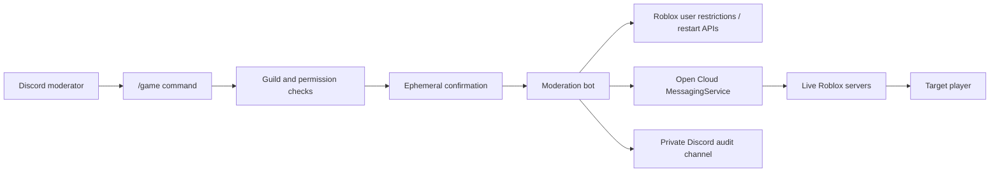

# Roblox Discord Moderation Bot

[](https://github.com/focalorrr/roblox-moderation-bot/actions/workflows/ci.yml)
[](https://github.com/focalorrr/roblox-moderation-bot/actions/workflows/codeql.yml)
[](https://github.com/focalorrr/roblox-moderation-bot/releases)
[](LICENSE)

Secure, self-hosted Discord slash commands for moderating Roblox experiences through supported Open Cloud APIs.

The project is intended for Roblox development teams that want staff to kick, ban, unban, inspect bans, and restart servers without distributing Creator credentials to every moderator.

## Features

- Roblox username and user-ID resolution
- Universe-level bans, temporary bans, alt-account handling, and unbans
- Cross-server kicks through MessagingService
- Active-ban pagination
- Universe server restarts
- Discord user, role, administrator, and guild authorization
- Protected Roblox accounts that cannot be moderated
- Confirmation prompts and staff audit logs
- Authenticated, versioned, expiring, replay-resistant kick messages
- Node.js and hardened Docker Compose deployments

## How it works



See [Architecture](docs/ARCHITECTURE.md) for trust boundaries and protocol details.

## Requirements

- Node.js 22+ and npm 10+, or Docker with Docker Compose
- A Discord application and bot token
- A Roblox Open Cloud API key restricted to the target universe
- Permission to install a server Script in the Roblox experience

## Quick start

1. Clone and install:

   ```bash
   git clone https://github.com/focalorrr/roblox-moderation-bot.git
   cd roblox-moderation-bot
   npm ci --ignore-scripts
   ```

2. Run the guided setup:

   ```bash
   npm run setup
   ```

   This creates ignored `.env` and `config.json` files, validates IDs, and generates a shared secret without printing it.

3. Replace the Discord and Roblox credential placeholders in `.env`.

4. Copy `RobloxScript/ModerationMessaging.server.lua` into `ServerScriptService`. Set its `TOPIC` to the value in `config.json` and its `MODERATION_SHARED_SECRET` to the generated value in `.env`.

5. Register the guild commands and start:

   ```bash
   npm run register
   npm run build
   npm start
   ```

For Docker, production hosting, upgrades, and required permissions, see [Deployment](docs/DEPLOYMENT.md).

## Commands

| Command | Effect |
| --- | --- |
| `/game kick username reason` | Kicks a user from every live server. |
| `/game ban username banalts duration reason` | Applies a universe-level join restriction. |
| `/game banlist` | Displays active restrictions privately with pagination. |
| `/game unban username reason` | Removes a universe-level join restriction. |
| `/game restartservers` | Requests a restart of active universe servers. |

State-changing commands require confirmation. Reasons are limited to 512 characters so the complete kick payload remains below Roblox's 1 KiB MessagingService limit.

## Security

The bot fails closed when credentials, configuration, guild identity, message authentication, or permissions are invalid. Keep the audit channel restricted to trusted staff and grant the Roblox key only the operations described in the deployment guide.

Report vulnerabilities privately according to [SECURITY.md](SECURITY.md). Never post credentials or live moderation records in an issue.

## Project status

The project is actively maintained. See the [Roadmap](ROADMAP.md), [Changelog](CHANGELOG.md), and public [Adopters](ADOPTERS.md) list. Usage entries are added only with an operator's consent and are never inferred from stars or forks.

## Contributing

Bug reports, documentation improvements, compatibility testing, and focused pull requests are welcome. Read [CONTRIBUTING.md](CONTRIBUTING.md) before contributing. General help is documented in [Support](SUPPORT.md) and [Troubleshooting](docs/TROUBLESHOOTING.md).

## License

[MIT](LICENSE) © 2026 Focalorrr.
